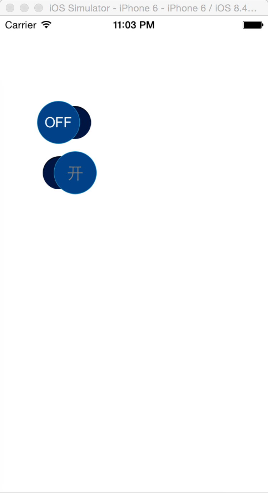

# TextSwitch

[](https://travis-ci.org/Eleven Chen/TextSwitch)
[](http://cocoapods.org/pods/TextSwitch)
[](http://cocoapods.org/pods/TextSwitch)
[](http://cocoapods.org/pods/TextSwitch)

## Usage

To run the example project, clone the repo, and run `pod install` from the Example directory first.

## Requirements

## Installation

TextSwitch is available through [CocoaPods](http://cocoapods.org). To install
it, simply add the following line to your Podfile:

```ruby
pod "TextSwitch"
```

## Author

Eleven Chen, skyhacker@126.com

##Screenshot



## License

TextSwitch is available under the MIT license. See the LICENSE file for more info.
